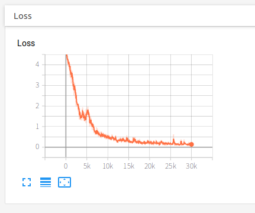

# SoftTriple

This is an unofficial implementation of ["SoftTriple Loss: Deep Metric Learning Without Triplet Sampling" (ICCV 2019)](https://arxiv.org/abs/1909.05235) in Pytorch.

## Installation

```
cd pytorch-hdml
pip install pipenv
pipenv install
```

## Download dataset

```
cd data
python cars196_downloader.py
python cars196_converter.py
```

## Train CARS196 dataset
Execute a training script. 
When executed, the tensorboard log is saved.

```
pipenv shell
python train_softtriple.py
```

## Result

### CARS196 result on training(99 classes, 30000 iterations)

#### Loss



#### t-SNE

